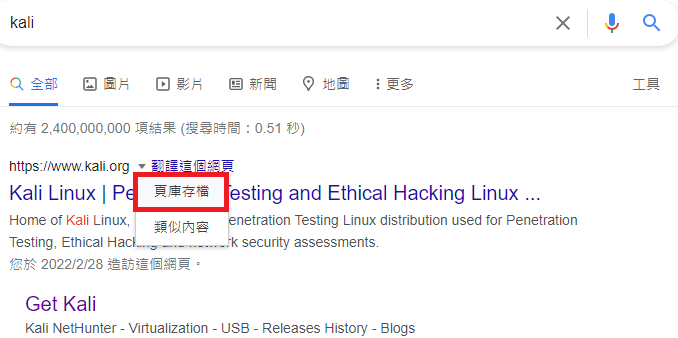

## NetHunter Rootless


### Installation:

從[store.nethunter.com](https://store.nethunter.com/)安裝 NetHunter-Store 應用程序

從 NetHunter 商店安裝**Termux**、**NetHunter-KeX client**和**Hacker’s keyboard**

打開 Termux 並輸入：
```
kali@kali:~$ termux-setup-storage
kali@kali:~$ pkg install wget
kali@kali:~$ wget -O install-nethunter-termux https://offs.ec/2MceZWr
kali@kali:~$ chmod +x install-nethunter-termux
kali@kali:~$ ./install-nethunter-termux
```


### Usage:

Command | To
- | -
`nethunter` | start Kali NetHunter command line interface
`nethunter kex passwd` | configure the KeX password (only needed before 1st use)
`nethunter kex &` | start Kali NetHunter Desktop Experience user sessions
`nethunter kex stop` | stop Kali NetHunter Desktop Experience
`nethunter <command>` | run in NetHunter environment
`nethunter -r` | start Kali NetHunter cli as root
`nethunter -r kex passwd` | configure the KeX password for root
`nethunter -r kex &` | start Kali NetHunter Desktop Experience as root
`nethunter -r kex stop` | stop Kali NetHunter Desktop Experience root sessions
`nethunter -r kex kill` | Kill all KeX sessions
`nethunter -r <command>` | run `<command>` in NetHunter environment as root





